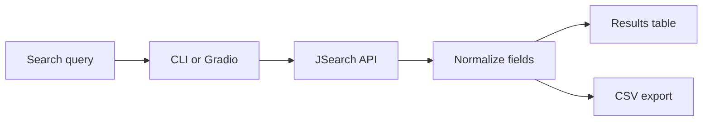

<p align="center">
  
</p>

# Remote Job Search

A tested Python client for searching remote roles through the JSearch API, reviewing normalized results, and exporting them to CSV.

The project exposes the same search workflow through two interfaces:

- a command-line tool for quick, scriptable searches;
- a Gradio interface for browser-based search, review, and CSV download.

Despite the repository’s original name, the application does not scrape job-board HTML. It consumes structured results from the JSearch API.

## What it does

- searches by role, technology, location, or any combined query;
- filters results with an ISO two-letter country code;
- optionally keeps only listings explicitly marked as remote;
- requests one or more result pages;
- displays results through a CLI or Gradio interface;
- removes duplicate listings while preserving result order;
- exports richer normalized results to CSV;
- creates output directories when needed;
- validates input before making a request;
- retries transient API failures with exponential backoff;
- surfaces configuration, authentication, rate-limit, and network errors clearly.

## Data flow



Both interfaces use `fetch_jobs_api`, so API parameters and result normalisation remain in one place.

## Result shape

Each API result is reduced to the fields the application needs:

| Field | Source |
|---|---|
| Job Title | `job_title` |
| Company | `employer_name` |
| Location | City, state, and country fields, with a remote fallback |
| Remote | `job_is_remote` |
| Employment Type | `job_employment_type` |
| Link | `job_apply_link`, with `job_google_link` as a fallback |
| Date Posted | `job_posted_at_datetime_utc` |

A generated CSV therefore looks like:

| Job Title | Company | Location | Remote | Employment Type | Link | Date Posted |
|---|---|---|---|---|---|---|
| Backend Engineer | Example Company | Berlin, DE | Yes | FULLTIME | https://… | 2026-07-15T09:00:00Z |
| Python Developer | Example Labs | Remote | Yes | CONTRACTOR | https://… | 2026-07-14T16:30:00Z |

The rows above illustrate the output format; they are not live search results.

## Requirements

- Python 3.10 or newer;
- a RapidAPI account;
- access to the JSearch API;
- a JSearch RapidAPI key.

## Quick start

```bash
git clone https://github.com/MerveilleDivine/remote-job-search.git
cd remote-job-search

python -m venv .venv
source .venv/bin/activate
pip install -r requirements.txt

cp .env.example .env
```

On Windows:

```powershell
.venv\Scripts\activate
copy .env.example .env
```

Add your key to `.env`:

```dotenv
API_KEY=your_rapidapi_key
```

The populated `.env` file is ignored by Git and should never be committed.

## Command-line usage

Search with the default country, `us`:

```bash
python code/scraper.py "backend engineer"
```

Search two result pages in the United Arab Emirates:

```bash
python code/scraper.py "python developer" --pages 2 --country ae
```

Keep only jobs that the API explicitly marks as remote:

```bash
python code/scraper.py "backend engineer" --remote-only
```

Search without a country restriction:

```bash
python code/scraper.py "remote data engineer" --country ""
```

Choose the output file:

```bash
python code/scraper.py "react developer" --output results/react_jobs.csv
```

### CLI options

| Argument | Purpose | Default |
|---|---|---|
| `keyword` | Search terms passed to JSearch | Required |
| `--pages` | Number of result pages | `1` |
| `--country` | ISO two-letter country code | `us` |
| `--remote-only` | Keep only listings marked remote | Off |
| `--output` | CSV destination | Generated from the keyword |

Page counts are validated from 1 to 10. If no output path is provided, the tool creates a portable lowercase filename from the query.

## Gradio interface

Launch the browser interface:

```bash
python code/app.py
```

The Gradio view provides:

- a keyword field;
- a validated page-count control;
- optional country field;
- a remote-only filter;
- status and tabular results;
- a CSV download button.

The GUI starts with a blank country value, which requests worldwide results. Each download uses an isolated temporary file so concurrent users do not overwrite one another.

## Repository map

```text
remote-job-search/
├── .github/workflows/python-ci.yml
├── assets/readme-banner.svg
├── code/
│   ├── __init__.py
│   ├── app.py
│   └── scraper.py
├── tests/test_scraper.py
├── .env.example
├── .gitignore
├── LICENSE
├── README.md
└── requirements.txt
```

| File | Responsibility |
|---|---|
| `code/scraper.py` | Validation, retrying API client, normalization, deduplication, CLI, and CSV output |
| `code/app.py` | Gradio interface, remote-only filtering, result table, and isolated CSV downloads |
| `tests/test_scraper.py` | Unit coverage for validation, API behavior, errors, deduplication, and export |
| `.env.example` | Safe environment-variable template |

## Quality checks

Run the test suite locally:

```bash
python -m unittest discover -s tests -v
```

GitHub Actions compiles the modules and runs the tests with Python 3.10 and 3.12 on every push and pull request to `main`. Tests use injected fake HTTP sessions, so they never consume API quota or require a real key.

## Current scope

This is intentionally a lightweight API client. It does not currently include:

- caching;
- saved searches;
- result ranking;
- salary normalization;
- scheduled alerts;
- pagination beyond the API's `num_pages` parameter.

Results depend on JSearch coverage and may include roles that are not fully remote. Country filtering is country-level; city names should be included in the query itself.

The strongest next step is persistent saved searches with local history, followed by optional caching and result ranking that does not hide the original API order.

## License

Licensed under the [MIT License](LICENSE).

## Technology

`Python` · `requests` · `pandas` · `Gradio` · `python-dotenv`
