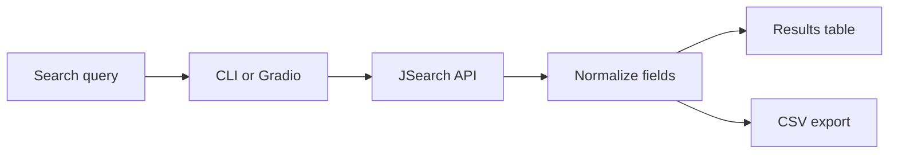

<p align="center">
  
</p>

# Remote Job Search

A small Python client for searching remote roles through the JSearch API.

The project exposes the same search workflow through two interfaces:

- a command-line tool for quick, scriptable searches;
- a Gradio interface for browser-based search, review, and CSV download.

Despite the repository’s original name, the application does not scrape job-board HTML. It consumes structured results from the JSearch API.

## What it does

- searches by role, technology, location, or any combined query;
- filters results with an ISO two-letter country code;
- requests one or more result pages;
- displays results through a CLI or Gradio interface;
- exports the normalized results to CSV;
- creates output directories when needed;
- applies an HTTP timeout and surfaces API errors.

## Data flow



Both interfaces use `fetch_jobs_api`, so API parameters and result normalisation remain in one place.

## Result shape

Each API result is reduced to the fields the application needs:

| Field | Source |
|---|---|
| Job Title | `job_title` |
| Company | `employer_name` |
| Location | `job_city` |
| Link | `job_apply_link` |
| Date Posted | `job_posted_at_datetime_utc` |

A generated CSV therefore looks like:

| Job Title | Company | Location | Link | Date Posted |
|---|---|---|---|---|
| Backend Engineer | Example Company | Berlin | https://… | 2026-07-15T09:00:00Z |
| Python Developer | Example Labs | Remote | https://… | 2026-07-14T16:30:00Z |

The rows above illustrate the output format; they are not live search results.

## Requirements

- Python 3.10 or newer;
- a RapidAPI account;
- access to the JSearch API;
- a JSearch RapidAPI key.

## Quick start

```bash
git clone https://github.com/MerveilleDivine/dev-job-scraper.git
cd dev-job-scraper

python -m venv .venv
source .venv/bin/activate
pip install -r requirements.txt

cp .env.example .env
```

On Windows:

```powershell
.venv\Scripts\activate
copy .env.example .env
```

Add your key to `.env`:

```dotenv
API_KEY=your_rapidapi_key
```

The populated `.env` file is ignored by Git and should never be committed.

## Command-line usage

Search with the default country, `us`:

```bash
python code/scraper.py "backend engineer"
```

Search two result pages in the United Arab Emirates:

```bash
python code/scraper.py "python developer" --pages 2 --country ae
```

Search without a country restriction:

```bash
python code/scraper.py "remote data engineer" --country ""
```

Choose the output file:

```bash
python code/scraper.py "react developer" --output results/react_jobs.csv
```

### CLI options

| Argument | Purpose | Default |
|---|---|---|
| `keyword` | Search terms passed to JSearch | Required |
| `--pages` | Number of result pages | `1` |
| `--country` | ISO two-letter country code | `us` |
| `--output` | CSV destination | Generated from the keyword |

If no output path is provided, the tool creates a lowercase filename from the query.

## Gradio interface

Launch the browser interface:

```bash
python code/app.py
```

The Gradio view provides:

- a keyword field;
- page-count control;
- optional country field;
- Markdown and tabular results;
- a CSV download button.

The GUI starts with a blank country value, which requests worldwide results.

## Repository map

```text
dev-job-scraper/
├── assets/readme-banner.svg
├── code/
│   ├── app.py
│   └── scraper.py
├── .env.example
├── .gitignore
├── LICENSE
├── README.md
└── requirements.txt
```

| File | Responsibility |
|---|---|
| `code/scraper.py` | API request, result normalisation, CLI parsing, and CSV output |
| `code/app.py` | Gradio interface and downloadable DataFrame |
| `.env.example` | Safe environment-variable template |

## Current scope

This is intentionally a lightweight API client. It does not currently include:

- automated tests or CI;
- retry and backoff handling;
- duplicate-result removal;
- caching;
- saved searches;
- result ranking;
- pagination beyond the API’s `num_pages` parameter.

Results depend on JSearch coverage and may include roles that are not fully remote. Country filtering is country-level; city names should be included in the query itself.

The strongest next step is to separate the API client into a testable service module, add mocked request tests, validate arguments before the request, and introduce retry handling for transient API failures.

## License

Licensed under the [MIT License](LICENSE).

## Technology

`Python` · `requests` · `pandas` · `Gradio` · `python-dotenv`
